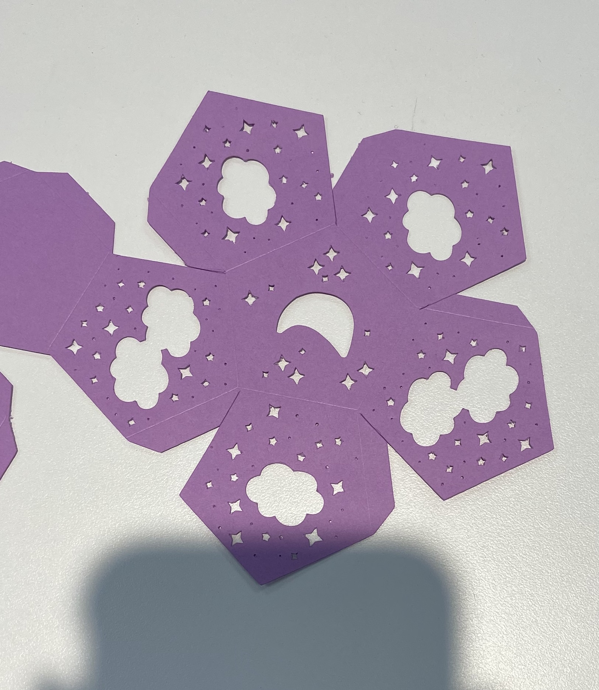
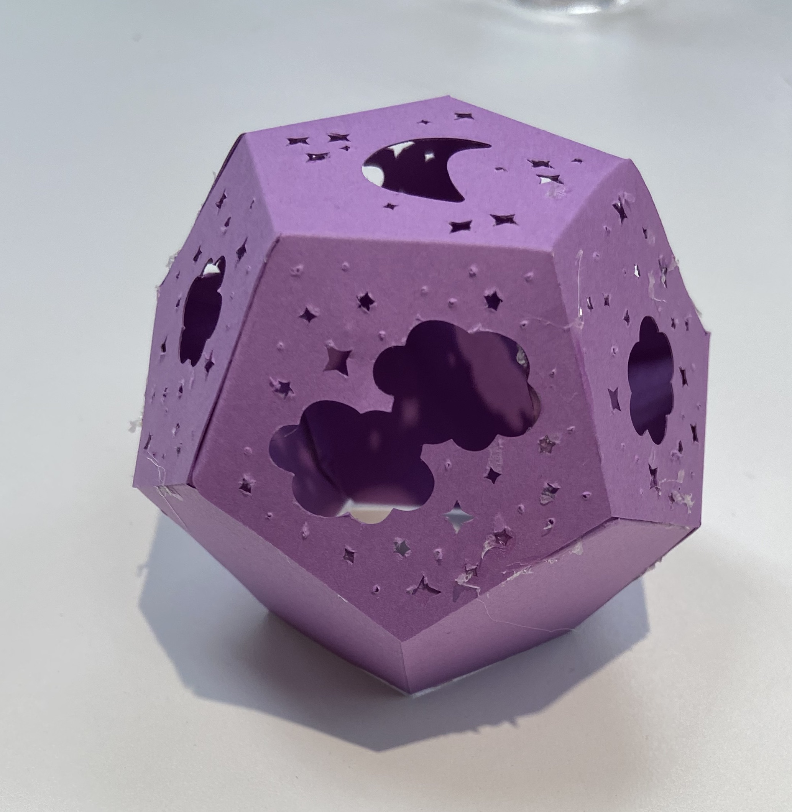
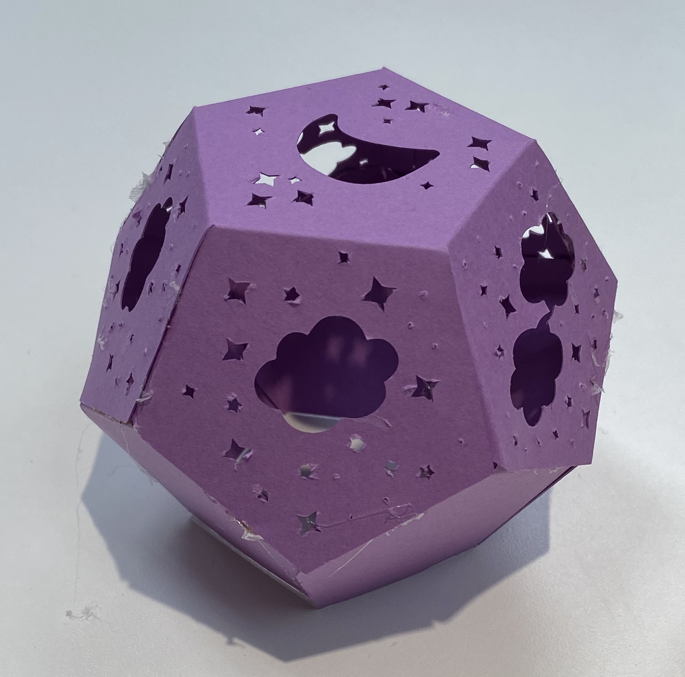
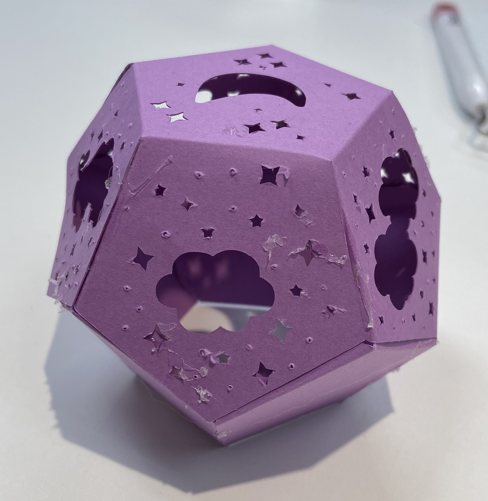
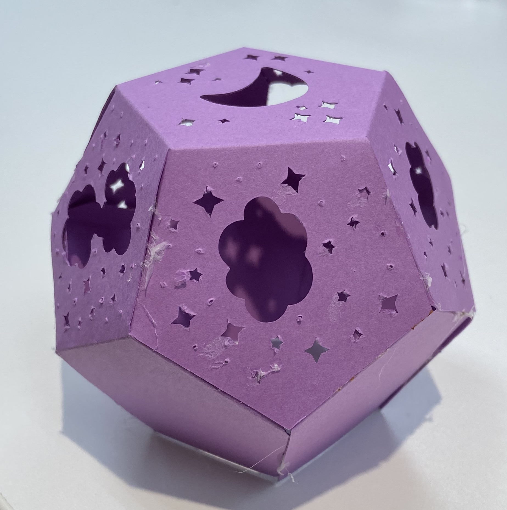
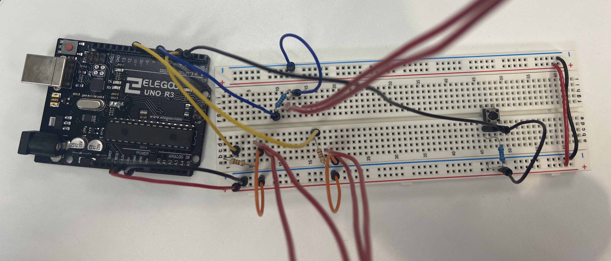
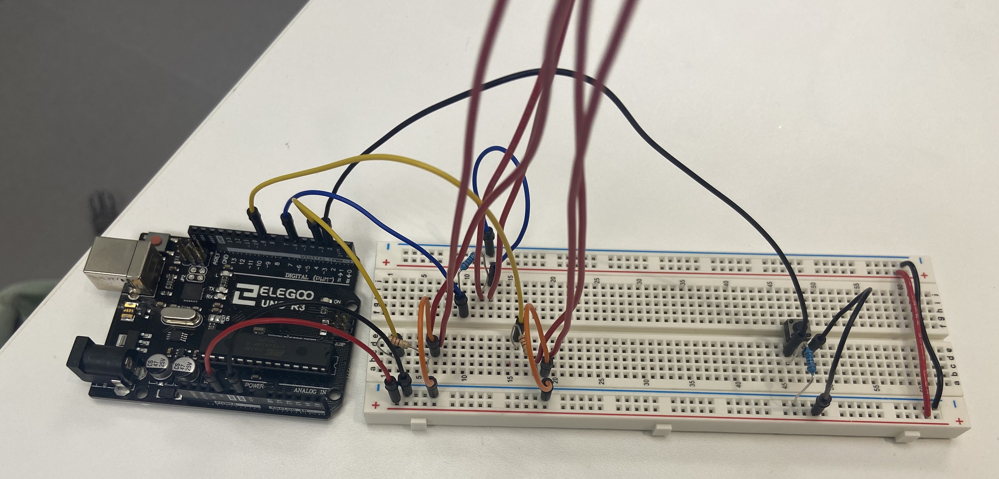
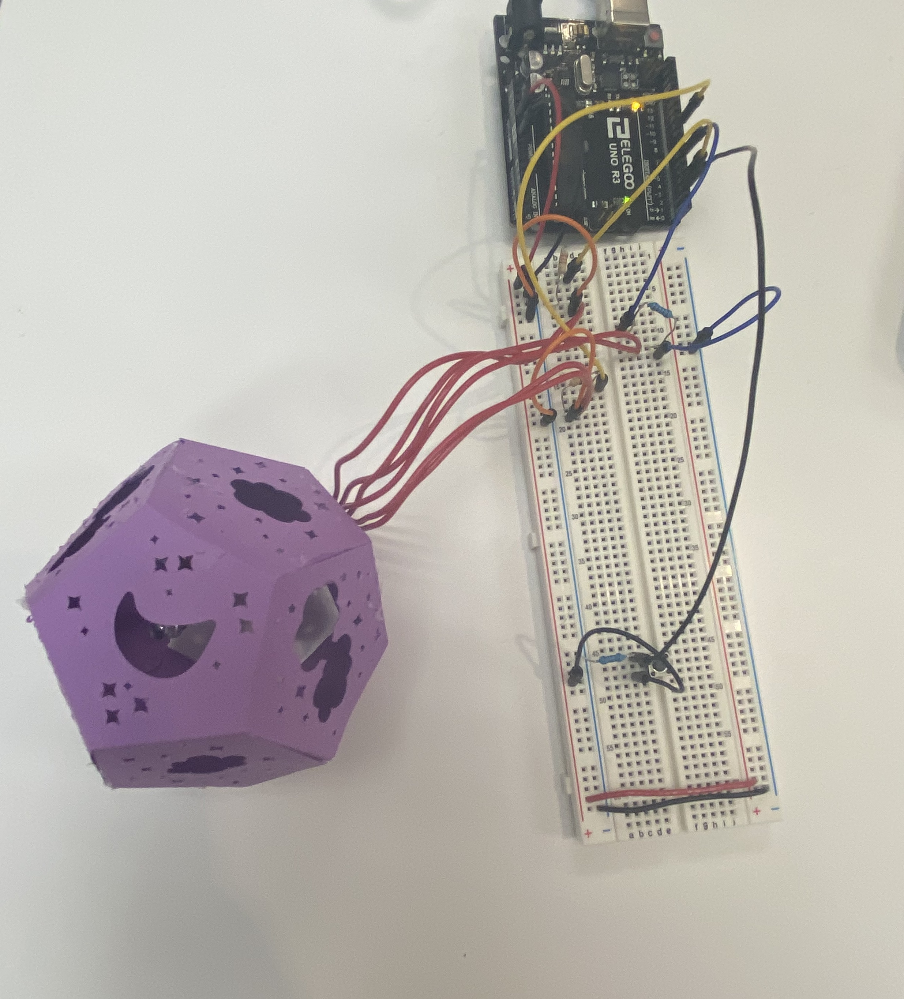

# Project 1: Lulled - Representing Emotion

#### Project Info:
The goal of the the project was to combine our knowledge of led programming and the circuit cutter to represent an emotion. The emotion I chose to represent is **lulled** (meaning calm down, quiet). 

To represent the emotion of being lulled into sleep I generated a nightlight with a calming on and off sequence.

 

#### Video

 

#### Structure
I used a dodecahedron [template](https://www.templatemaker.nl/en/#section-platonic-solids) to create the "shade" for the lights. I cut stars, moons, and clouds into the panels that would appear on the upper half, with the intention that the light would shine to the walls in such shapes. The cuts were made using the cricuit cutter. I elected not to dim the lights with druler paper because in dark enough settings the device would work as a nightlight. 

 

#### Circuit
- 3 220ohm resistrs
- 3 leds (2 purple, 1 blue)
- 1 button
- 1 10k resistor

 

#### [Code](code/project1/project1.ino)
The code features 3 modes with a calming fade that is inteaded for people to breathe with to relax
- 1 press = lights turn on and stay on
- 2 press = lights in the fade sequence
- 3 press = turn the lights off until pressed again

 

#### Issues
- The wires kept breaking from the led so I had to re-extend the leds
- I should have printed the shape larger so that the small parts would have cut out nicer
- I should have also used something other than hot glue since it singed the edges of the paper

